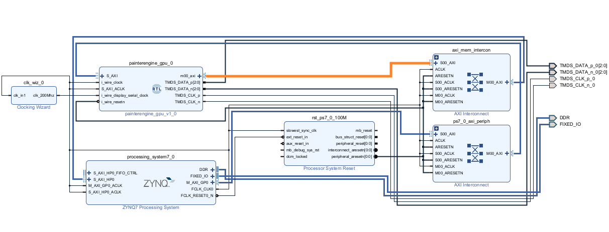
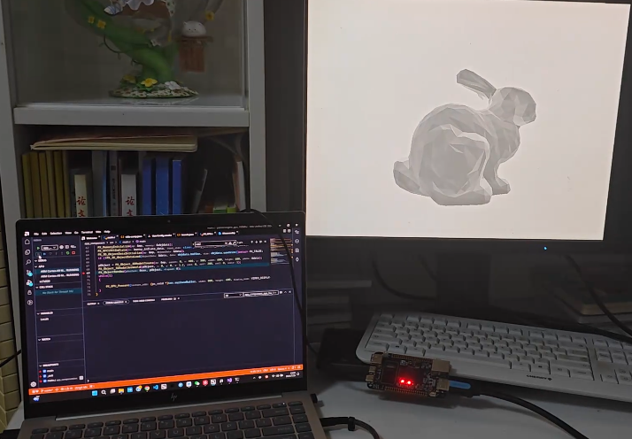
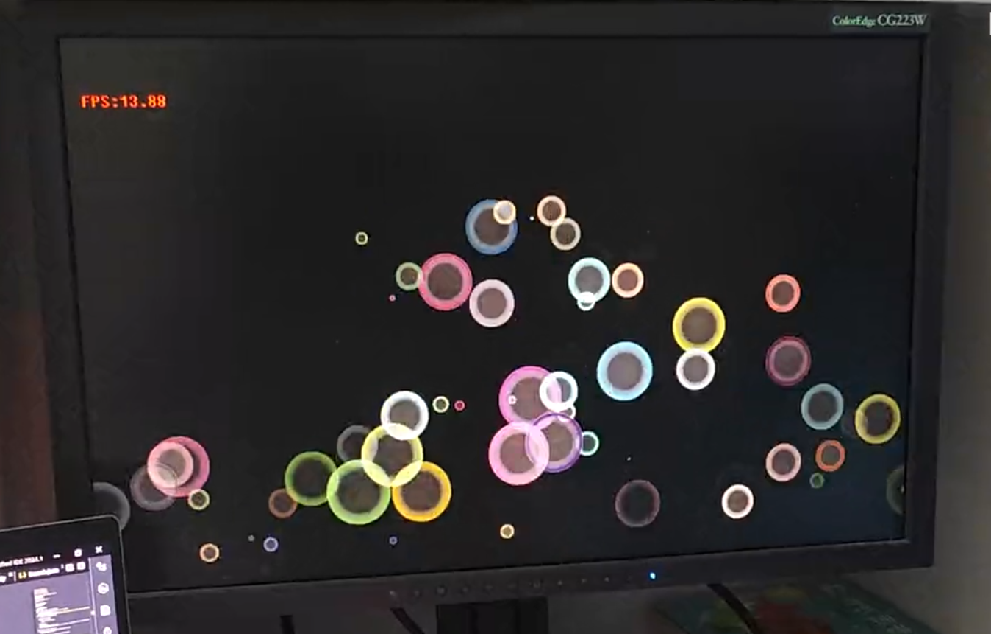

<p align="center">
  <a href="https://painterengine.com" target="_blank" rel="noopener noreferrer">
    
  </a>
</p>

[](https://github.com/QuantumCipherMaster/PainterEngine/blob/master/README.md)

PainterEngine is a cross-platform graphics engine written in C language, with support for Windows, Linux, iOS, Android, WebAssembly, and even bare-metal embedded platforms without OS. It is built on a component-based design pattern, making it accessible to even C language beginners. [PainterEngine Make](https://www.painterengine.com/) enables you to compile your PainterEngine project for multiple platforms with just one click.
It covers various fields including basic data structures, graphics, acoustics, digital signal processing, compiler design, virtual machine systems, cryptography, human-computer interaction, game engines, FPGA-GPU graphics acceleration, and more. You can use it to create mini-applications or as a learning project for acquiring knowledge.

## 30-Second Quick Start Guide to PainterEngine

To incorporate PainterEngine into your project, all you need is:

```c
#include "PainterEngine.h"
```

Utilize `PainterEngine_Initialize` to swiftly create a graphical interactive interface:

```c
#include "PainterEngine.h"
int main()
{
    PainterEngine_Initialize(800, 600);
    return 1;
}
```

Create components or even craft your own:

```c
#include "PainterEngine.h"
int main()
{
    PainterEngine_Initialize(800, 600);
    PX_Object_Firework01Create(mp, root,200,600);
    PX_Object_Firework01Create(mp, root,400,600);
    PX_Object_Firework01Create(mp, root,600,600);
    return 1;
}
```

<p align="center">
  
</p>

Use ["PainterEngine Make"](https://www.painterengine.com/) to quickly compile and deploy your project to various platforms such as Windows, Linux, WebAssembly, Android, and more. One-click compilation and deployment, with no need to modify the source code, enabling seamless portability at zero cost.

<p align="center">
  <a href="https://cdn.painterengine.com/PainterEngine_make_en.zip" target="_blank" rel="noopener noreferrer">
    
  </a>
</p>

## Swift development and smooth transitions

If you don't need the one-key compilation feature provided by PainterEngine Make and prefer to develop PainterEngine programs or components using your preferred IDE, you just need to:

1. Add all the code from "PainterEngine/core", "PainterEngine/kernel", and "PainterEngine/runtime" to your project.

2. Select your working platform in "PainterEngine/platform" (eg: choose "PainterEngine/platform/windows" for Windows), and add all the code from the corresponding folder to your project.

3. Include the directory containing PainterEngine source code in your project's include directories.

4. Add your code to the project.

## Not just a graphics library but also an application framework

| Functions             | Support                                                      | Description                                                                       |
| --------------------- | ------------------------------------------------------------ | ------------------------------------------------------------------------          |
| memorypool            | alloc/free                                                   | Platform-agnostic memory management implementation                               |
| math               | sin/cos/tan/arcsin/log/exp/relu/...                | The complete implementation of the vast majority of C standard math libraries                          |
| signal processing     | dft/dct/fft/dwt/window functions/mfcc/...                | Fourier/Cosine/Wavelet Transform, common window functions, MFCC, and other signal processing fundamental functions and higher-level feature extraction algorithms, etc.                         |
| Data structures       | string/vector/list/map/stack/fifo/circular-buffer/...                | Platform-agnostic common data structures and algorithms                          |
| Cryptography          | curve25519/AES/SHAx/MD5/...                | This includes commonly used symmetric key algorithms and key exchange algorithms                          |
| image codec           | PNG/JPG/GIF/BMP                                              | Supports decoding of PNG/JPG/GIF/BMP images and encoding of PNG images           |
| audio codec           | Wav/Mp3                                              | Supports decoding of Wav/Mp3 and encoding of Wav           |
| fontmodule            | TTF                                                  | Support fontmodule of truetype(reference: stb_truetype.c)|
| Geometric             | Line/Triangle/Rectangle/Circle/Ring/Sector/Rounded/...      | Geometric rasterization                                                           |
| Renderer              | 2D/3D                                                        | Implementation of a 2D/3D software renderer. A painting engine                  |
| sound                 | VC codec/mixer/piano/ks                                               | Includes an implementation of a VC(voice conversion), a mixer, a physically-modeled piano and Karplus-Strong string synthesis. Direct synthesis of PCM audio streams|
| Animation             | 2dx/live2D                                                   | 2D frame-by-frame animation and a Live2D-style animation system                  |
| PainterScript         | Compiler/VM/Debugger                                         | A complete scripting engine, including a compiler, virtual machine, and debugger |
| UI                    | button/radio/image/edit/label/list/...                       | Implementation of common UI controls                                             |
| protocols             | MQTT/MODBUS/Game-network-synchronization                     | Common communication protocols                                                   |
| Game framework        |                                                              | PainterEngine Game Framework                                                      |
| FPGA-GPU             | 2D accelerator                                               | Implemented an FPGA-based GPU graphics accelerator that provides at least 50 million pixels per second (Mpps) 2D Blender acceleration for PainterEngine and supports HDMI output. Validation has been completed on the Zynq-7000 series SoC|

## The FPGA-GPU Graphics Acceleration Solution

A GPU IP core based on FPGA has been developed and functionally verified on the Zynq 7020 platform. It provides 2D Blender graphics rendering acceleration with a performance of no less than 50Mpps (Million pixels per second) and supports HDMI output. This solution has been successfully validated on the Zynq 7000 series SoC.

<p align="center"></p>

<p align="center"></p>

<p align="center"></p>

## Component-based development with support for a designer mode, making it as simple as it gets

<p align="center"></p>

## An abundance of components to unleash your creativity without limitations

<p align="center"></p>

<p align="center"></p>

<p align="center"></p>

<p align="center"></p>

## Now, join the PainterEngine.com contribute to its development

<p align="center">


</p>

<p align="center">


</p>

<p align="center">


</p>

<p align="center">


</p>
