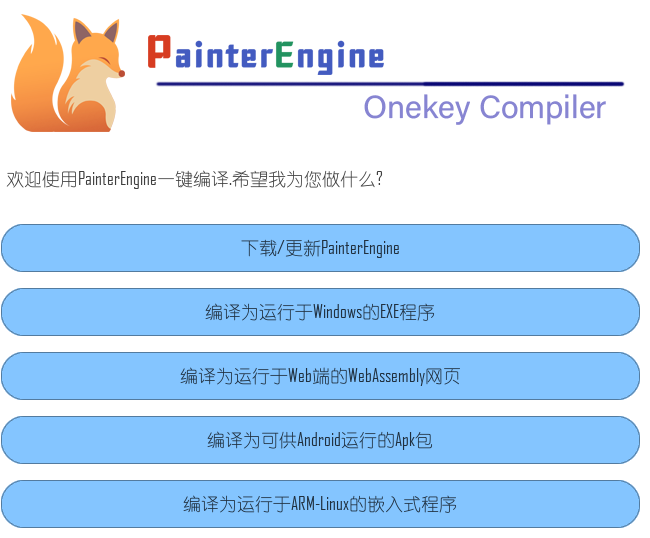

<p align="center"><a href="https://painterengine.com" target="_blank" rel="noopener noreferrer"></a></p>

PainterEngine是一个由C语言编写的跨平台图形引擎,支持windows/linux/ios/android/webassembly甚至无操作系统的裸嵌入式平台,它基于组件化的设计模式,即使是C语言初学者,也可以在几分钟内掌握它的使用,PainterEngine Make允许您一键将您的PainterEngine项目编译到多个平台.

PainterEngine is a cross-platform graphics engine written in C language, with support for Windows, Linux, iOS, Android, WebAssembly, and even bare-metal embedded platforms without OS. It is built on a component-based design pattern, making it accessible to even C language beginners . PainterEngine Make enables you to compile your PainterEngine project for multiple platforms with just one click.

## 30秒快速入门PainterEngine

## 30-Second Quick Start Guide to PainterEngine

将PainterEngine引入到您的项目中,仅仅需要"#include "PainterEngine.h"

To incorporate PainterEngine into your project, all you need is 
```c
#include "PainterEngine.h"
```
使用PainterEngine_Initialize,快速创建一个图形化的交互式界面

Utilize 'PainterEngine_Initialize' to swiftly create a graphical interactive interface.
```c
#include "PainterEngine.h"
int main()
{
	PainterEngine_Initialize(800, 600);
	return 1;
}
```

创建组件,或者....创造自己的组件

Create components or even craft your own.

```c
#include "PainterEngine.h"
int main()
{
	PainterEngine_Initialize(800, 600);
	PX_Object_Firework01Create(mp, root,200,600);
	PX_Object_Firework01Create(mp, root,400,600);
	PX_Object_Firework01Create(mp, root,600,600);
	return 1;
}
```
<p align="center"></p>

使用PainterEngine make快速将您的项目编译到Windows Linux WebAssembly  Android等任意平台,一键编译部署,源码无需修改,零成本移植

Use "PainterEngine make" to quickly compile and deploy your project to various platforms such as Windows, Linux, WebAssembly, Android, and more. One-click compilation and deployment, with no need to modify the source code, enabling seamless portability at zero cost

<p align="center"><a href="https://www.painterengine.com/download/PainterEngine_make.zip" target="_blank" rel="noopener noreferrer"></a></p>

## 不仅是图形库,更是应用程序框架

## Not just a graphics library but also an application framework.

| functions             | support                                                      | Description                                                                       |
| --------------------- | ------------------------------------------------------------ | ------------------------------------------------------------------------          |
| 内存池                 | alloc/free                                                   | 平台无关的内存池实现                              |
| 数据结构               | vector/list/map/stack/fifo/circular-buffer...                | 平台无关的数据结构算法实现                          |
| 图片支持               | PNG/JPG/GIF/BMP                                              | 支持PNG/JPG/GIF/BMP解码及PNG编码.           |
| 几何绘制               | Line/Triangle/Rectangle/Circle/Ring/Sector/Rounded.....      | 常用几何光栅化实现                                                                 |
| 渲染器                | 2D/3D                                                        | 2D 3D渲染器实现及一个高质量制图引擎                                                 |
| 动画                  | 2dx/live2D                                                   | 2D 动画和一个类Live2D 骨骼动画系统                                                  |
| 声学模型               | mixer/piano/ks                                               | 包含一个混音器实现,一个物理建模的钢琴及karplus-strong合成的拨弦模型,直接合成PCM音频流   |
| 脚本引擎               | Compiler/VM/Debugger                                         | A一个完整的脚本引擎,包含编译器虚拟机调试器                                           |
| UI框架                 | button/radio/image/edit/label/list....                       | UI框架实现                                                                        |
| 协议                   | MQTT/MODBUS/Game-network-synchronization                     | 常用的通讯协议                                                                    |
| 游戏引擎               |                                                              | 集成一个游戏世界框架                                                               |

还有更多探索...

///////////////////////////////////////////////////////////////////////////////


| functions             | support                                                      | Description                                                                       |
| --------------------- | ------------------------------------------------------------ | ------------------------------------------------------------------------          |
| memorypool            | alloc/free                                                   | Platform-agnostic memory management implementation.                               |
| Data structures       | vector/list/map/stack/fifo/circular-buffer...                | Platform-agnostic common data structures and algorithms.                          |
| image codec           | PNG/JPG/GIF/BMP                                              | Supports decoding of PNG/JPG/GIF/BMP images and encoding of PNG images.           |
| Geometric             | Line/Triangle/Rectangle/Circle/Ring/Sector/Rounded.....      | Geometric rasterization                                                           |
| Renderer              | 2d/3d                                                        | Implementation of a 2D/3D software renderer. A painting  engine.                  |
| sound                 | mixer/piano/ks                                               | Includes an implementation of a mixer, a physically-modeled piano and Karplus-Strong string synthesis. Direct synthesis of PCM audio streams.|
| Animation             | 2dx/live2D                                                   | 2D frame-by-frame animation and a Live2D-style animation system.                  |
| PainterScript         | Compiler/VM/Debugger                                         | A complete scripting engine, including a compiler, virtual machine, and debugger. |
| UI                    | button/radio/image/edit/label/list....                       | Implementation of common UI controls.                                             |
| protocals             | MQTT/MODBUS/Game-network-synchronization                     | Common communication protocols.                                                   |
| Game framework.       |                                                              | PainterEngine Game Framework                                                      |

Many more to explore....

## 组件化开发,支持设计器模式,简单的不能再简单

## Component-based development with support for a designer mode, making it as simple as it gets

<p align="center"></p>

## 海量组件,创意无界

## An abundance of components to unleash your creativity without limitations.

<p align="center"></p>

<p align="center"></p>

<p align="center"></p>

<p align="center"></p>

### 现在,访问PainterEngine.com,参与建设

### Now, join the PainterEngine.com contribute to its development.
