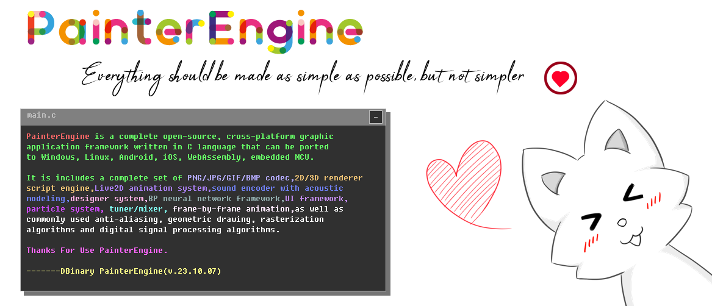
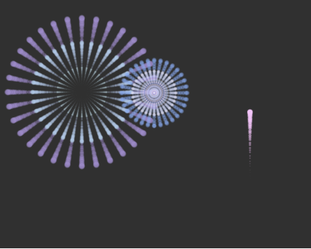
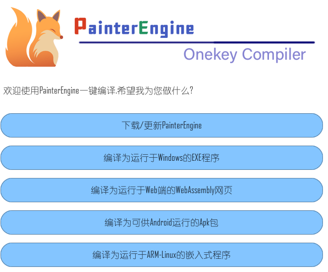
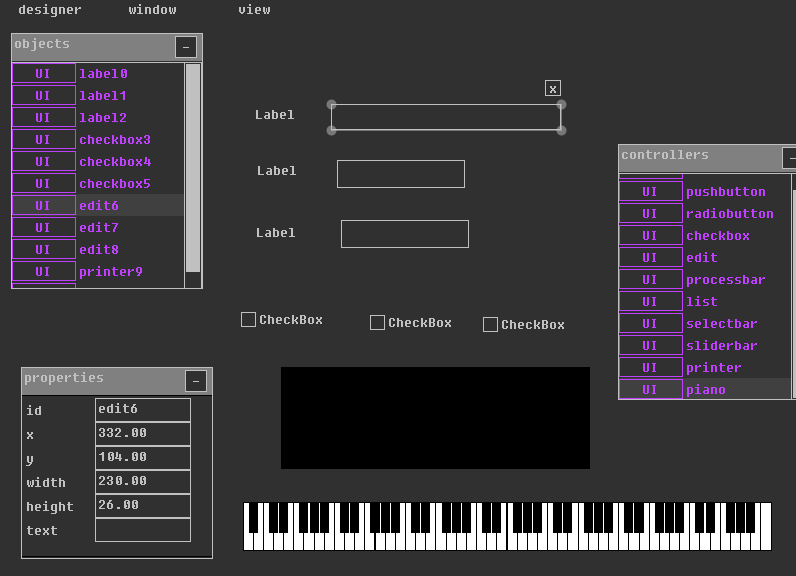
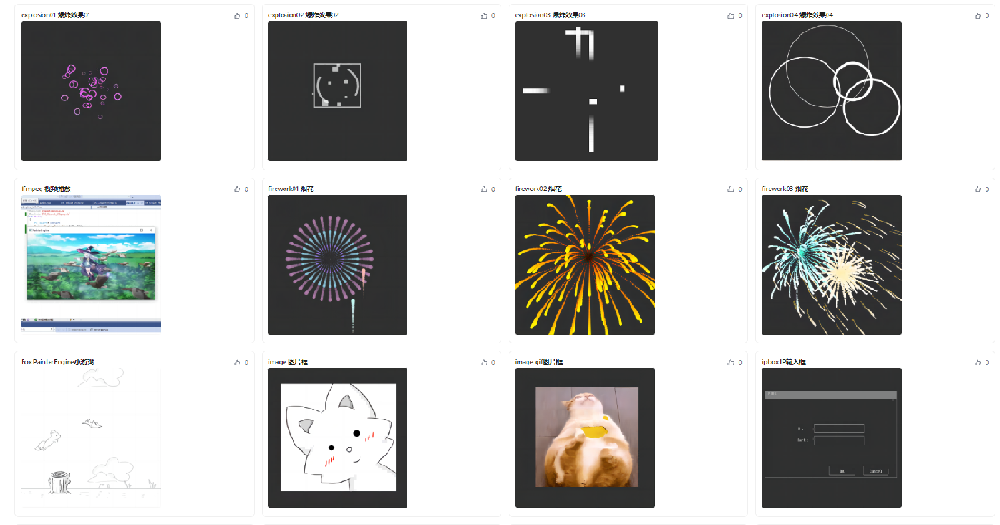
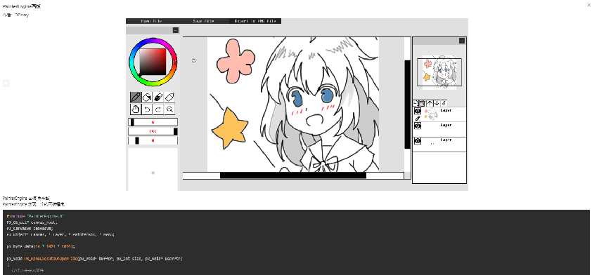
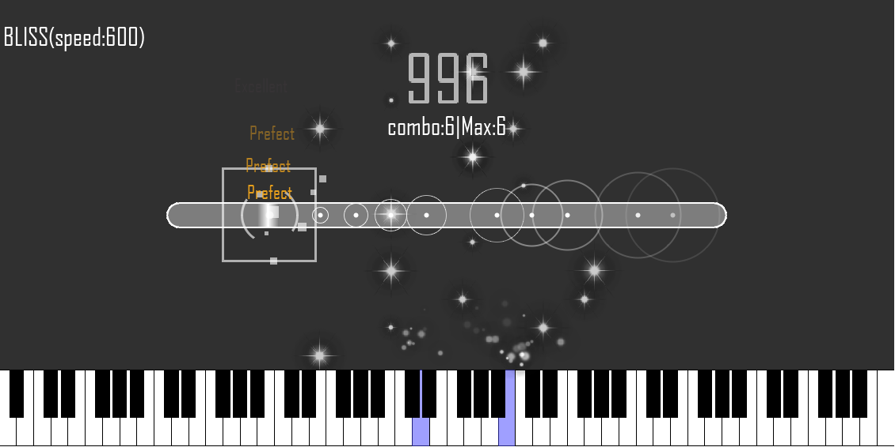
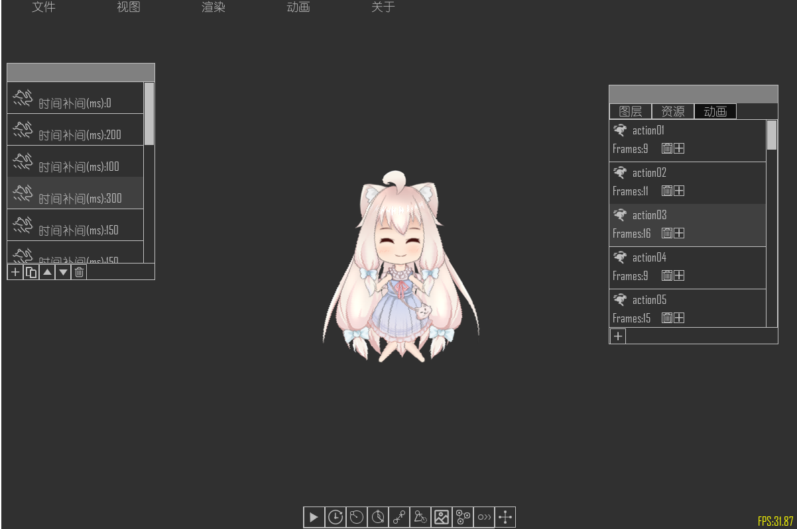

<p align="center"><a href="https://painterengine.com" target="_blank" rel="noopener noreferrer"></a></p>

PainterEngine是一个由C语言编写的跨平台图形引擎,支持windows/linux/ios/android/webassembly甚至无操作系统的裸嵌入式平台,它基于组件化的设计模式,即使是C语言初学者,也可以在几分钟内掌握它的使用,[PainterEngine Make](https://www.painterengine.com/)允许您一键将您的PainterEngine项目编译到多个平台.
它涵盖了基础数据结构、图形学、声学、数字信号处理、编译原理、虚拟机系统、密码学、人机交互、游戏引擎等多个领域，你既可以用它制作微应用，也可以将它作为学习项目。

PainterEngine is a cross-platform graphics engine written in C language, with support for Windows, Linux, iOS, Android, WebAssembly, and even bare-metal embedded platforms without OS. It is built on a component-based design pattern, making it accessible to even C language beginners . [PainterEngine Make](https://www.painterengine.com/) enables you to compile your PainterEngine project for multiple platforms with just one click.
It covers various fields including basic data structures, graphics, acoustics, digital signal processing, compiler design, virtual machine systems, cryptography, human-computer interaction, game engines, and more. You can use it to create mini-applications or as a learning project for acquiring knowledge.

## 30秒快速入门PainterEngine

## 30-Second Quick Start Guide to PainterEngine

将PainterEngine引入到您的C/C++项目中,仅仅需要"#include "PainterEngine.h"

To incorporate PainterEngine into your project, all you need is 
```c
#include "PainterEngine.h"
```
使用PainterEngine_Initialize,快速创建一个图形化的交互式界面

Utilize 'PainterEngine_Initialize' to swiftly create a graphical interactive interface.
```c
#include "PainterEngine.h"
int main()
{
	PainterEngine_Initialize(800, 600);
	return 1;
}
```

创建组件,或者....创造自己的组件

Create components or even craft your own.

```c
#include "PainterEngine.h"
int main()
{
	PainterEngine_Initialize(800, 600);
	PX_Object_Firework01Create(mp, root,200,600);
	PX_Object_Firework01Create(mp, root,400,600);
	PX_Object_Firework01Create(mp, root,600,600);
	return 1;
}
```
<p align="center"></p>

使用[PainterEngine Make](https://www.painterengine.com/)快速将您的项目编译到Windows Linux WebAssembly  Android等任意平台,一键编译部署,源码无需修改,零成本移植

Use ["PainterEngine Make"](https://www.painterengine.com/) to quickly compile and deploy your project to various platforms such as Windows, Linux, WebAssembly, Android, and more. One-click compilation and deployment, with no need to modify the source code, enabling seamless portability at zero cost

<p align="center"><a href="https://cdn.painterengine.com/PainterEngine_make.zip" target="_blank" rel="noopener noreferrer"></a></p>

<p align="center"><a href="https://cdn.painterengine.com/PainterEngine_make_en.zip" target="_blank" rel="noopener noreferrer"></a></p>

## 快速开发,无缝迁移
## Swift development and smooth transitions

如果您不需要PainterEngine Make提供的一键编译功能,希望使用自己常用的IDE开发PainterEngine程序或组件,您只需要:

1. 将"PainterEngine/core","PainterEngine/kernel","PainterEngine/runtime"的所有代码,添加到您的项目中. 

2. 在PainterEngine/platform中选择您的工作平台(例如windows中选择PainterEngine/platform/windows),并将对应文件夹中的所有代码添加到您的项目中.

3. 将PainterEngine所在目录,添加到包含目录中. 

4. 将您的代码添加进项目中.

即可使用您的IDE完成PainterEngine的编译,PainterEngine库将尽力保证所有平台的的运行结果一致性,在windows上开发,同样在Android/web/linux/ios..中能够得到一致的结果.


If you don't need the one-key compilation feature provided by PainterEngine Make and prefer to develop PainterEngine programs or components using your preferred IDE, you just need to:

1. Add all the code from PainterEngine/core, PainterEngine/kernel, and PainterEngine/runtime to your project.

2. Select your working platform in PainterEngine/platform (eg: choose PainterEngine/platform/windows for Windows), and add all the code from the corresponding folder to your project.

3. Include the directory containing PainterEngine source code in your project's include directories.

4. Add your code to the project.

You can now use your IDE to compile PainterEngine with these steps. PainterEngine library will strive to ensure consistent results across all platforms. What you develop on Windows will yield consistent results on Android, web, Linux, iOS, and more."

## 不仅是图形库,更是应用程序框架

## Not just a graphics library but also an application framework.

| functions             | support                                                      | Description                                                                       |
| --------------------- | ------------------------------------------------------------ | ------------------------------------------------------------------------          |
| 内存池                 | alloc/free                                                   | 平台无关的内存池实现                              |
| 数学库               | sin/cos/tan/arcsin/log/exp/relu....                | 绝大部分c标准数学库的完整实现                          |
| 信号处理               | dft/dct/fft/dwt/window functions/mfcc/....                | 傅里叶/余弦/小波变换,常用窗函数,mfcc等特征采集算法...等等信号处理相关基础函数及上层特征采集算法                         |
| 数据结构               | string/vector/list/map/stack/fifo/circular-buffer...                | 平台无关的数据结构算法实现                          |
| 密码学               | curve25519/AES/SHAx/MD5...                | 包含常用的密钥对称算法及密钥协商算法                          |
| 图片支持               | PNG/JPG/GIF/BMP                                              | 支持PNG/JPG/GIF/BMP解码及PNG编码.           |
| 音频支持               | WAV/MP3                                              | 支持Wav,Mp3解码.及Wav编码|
| 字模支持               | ttf                                              | 支持ttf字模文件(由stb_truetype.c移植而来)|
| 几何绘制               | Line/Triangle/Rectangle/Circle/Ring/Sector/Rounded.....      | 常用几何光栅化实现                                                                 |
| 渲染器                | 2D/3D                                                        | 2D 3D渲染器实现及一个高质量制图引擎                                                 |
| 动画                  | 2dx/live2D                                                   | 2D 动画和一个类Live2D 骨骼动画系统                                                  |
| 声学模型               | mixer/piano/ks                                               | 包含一个混音器实现,一个相位声码器,一个物理建模的钢琴及karplus-strong合成的拨弦模型,直接合成PCM音频流   |
| 脚本引擎               | Compiler/VM/Debugger                                         | A一个完整的脚本引擎,包含编译器虚拟机调试器                                           |
| UI框架                 | button/radio/image/edit/label/list....                       | UI框架实现                                                                        |
| 协议                   | MQTT/MODBUS/Game-network-synchronization                     | 常用的通讯协议                                                                    |
| 游戏引擎               |                                                              | 集成一个游戏世界框架                                                               |

还有更多探索...

///////////////////////////////////////////////////////////////////////////////


| functions             | support                                                      | Description                                                                       |
| --------------------- | ------------------------------------------------------------ | ------------------------------------------------------------------------          |
| memorypool            | alloc/free                                                   | Platform-agnostic memory management implementation.                               |
| math               | sin/cos/tan/arcsin/log/exp/relu....                | The complete implementation of the vast majority of C standard math libraries.                          |
| signal processing     | dft/dct/fft/dwt/window functions/mfcc/....                | Fourier/Cosine/Wavelet Transform, common window functions, MFCC (Mel-Frequency Cepstral Coefficients), and other signal processing fundamental functions and higher-level feature extraction algorithms, etc.                         |
| Data structures       | string/vector/list/map/stack/fifo/circular-buffer...                | Platform-agnostic common data structures and algorithms.                          |
| Cryptography          | curve25519/AES/SHAx/MD5...                | This includes commonly used symmetric key algorithms and key exchange algorithms.                          |
| image codec           | PNG/JPG/GIF/BMP                                              | Supports decoding of PNG/JPG/GIF/BMP images and encoding of PNG images.           |
| audio codec           | Wav/Mp3                                              | Supports decoding of Wav/Mp3 and encoding of Wav.           |
| fontmodule            | TTF                                                  | Support fontmodule of truetype(reference:stb_truetype.c)|
| Geometric             | Line/Triangle/Rectangle/Circle/Ring/Sector/Rounded.....      | Geometric rasterization                                                           |
| Renderer              | 2d/3d                                                        | Implementation of a 2D/3D software renderer. A painting  engine.                  |
| sound                 | VC codec/mixer/piano/ks                                               | Includes an implementation of a VC(voice conversion), a mixer, a physically-modeled piano and Karplus-Strong string synthesis. Direct synthesis of PCM audio streams.|
| Animation             | 2dx/live2D                                                   | 2D frame-by-frame animation and a Live2D-style animation system.                  |
| PainterScript         | Compiler/VM/Debugger                                         | A complete scripting engine, including a compiler, virtual machine, and debugger. |
| UI                    | button/radio/image/edit/label/list....                       | Implementation of common UI controls.                                             |
| protocals             | MQTT/MODBUS/Game-network-synchronization                     | Common communication protocols.                                                   |
| Game framework.       |                                                              | PainterEngine Game Framework                                                      |

Many more to explore....

## 组件化开发,支持设计器模式,简单的不能再简单

## Component-based development with support for a designer mode, making it as simple as it gets

<p align="center"></p>

## 海量组件,创意无界

## An abundance of components to unleash your creativity without limitations.

<p align="center"></p>

<p align="center"></p>

<p align="center"></p>

<p align="center"></p>

### 现在,访问PainterEngine.com,参与建设

### Now, join the PainterEngine.com contribute to its development.
